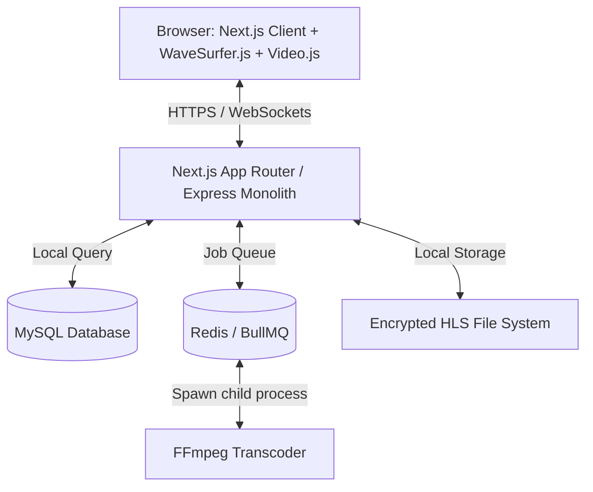

# Royaljed Academy Diction & Elocution App
## System Architecture & Technical Design Blueprint

This document outlines the software architecture, database design, key feature pipelines, and implementation phases for the Royaljed Academy Diction & Elocution application.

---

## 1. System Overview & Architectural Principles

The application is structured as a **single-box multi-tenant monolith** designed to run on a Hostinger KVM2 VPS plan. It replaces physical elocution facilitators with a digital tool while keeping administration, tutoring, and assessment entirely within the platform.

### Core Architectural Decisions
1. **Hostinger KVM2 VPS Suitability:** Next.js and Express will run as a monolithic application managed by `PM2`. A local MySQL instance will serve as the database. Background tasks (like video transcoding via `ffmpeg`) will run on the same box using a lightweight Redis queue (`BullMQ`) to prevent blocking the web app.
2. **True Multi-Tenancy:** Each school or client organization operates in an isolated workspace identified by a unique URL slug (e.g., `/ec/oshewolo-demo/`). Data isolation is enforced at the database level by partitioning all core tables via a `school_id` foreign key.
3. **No Third-Party SaaS Subscriptions:** All core features—including video transcoding, encrypted HLS streaming, WebRTC signaling, and student voice practice comparison—are self-hosted on the VPS with zero recurring 3rd-party SaaS licensing dependencies (no AWS, no Mux, no Twilio WebRTC).

---

## 2. Tech Stack Definition



| Layer | Technology | Role |
| :--- | :--- | :--- |
| **Frontend Framework** | **Next.js 14/15 (App Router)** | User interfaces, client-side routing, interactive dashboards, dynamic pages. |
| **Backend Core** | **Next.js Route Handlers & Custom Express Server** | API layer, authentication middleware, asset delivery streams, and WebSockets (Socket.io) for WebRTC signaling. |
| **Database** | **MySQL 8.0** | Relational data persistence, schema-based transactions. |
| **ORM / Query Builder** | **Prisma ORM** | Schema definition, migrations, type-safe queries. |
| **Background Processing**| **BullMQ + Redis** | Queue manager for long-running video transcoding tasks. |
| **Transcoding Engine** | **FFmpeg (installed on VPS)** | Command-line utility to convert raw `.mp4` uploads to segmented `.m3u8` HLS feeds. |
| **Audio Processing** | **Web Audio API + WaveSurfer.js** | Browser-side voice recording, playback, and waveform rendering. |
| **WebRTC Signaling** | **Socket.io** | Signaling mechanism for peer-to-peer audio/video rooms. |
| **Authentication** | **Next-Auth.js** | Cookie-based session storage, custom credentials provider, and Google OAuth2 link handlers. |

---

## 3. Database Schema Design (MySQL)

Enforced via Prisma schemas. Relationships are strictly defined with cascade rules.

```sql
-- 1. Schools (Tenants)
CREATE TABLE `schools` (
  `id` VARCHAR(191) NOT NULL PRIMARY KEY,
  `name` VARCHAR(191) NOT NULL,
  `slug` VARCHAR(191) NOT NULL UNIQUE,
  `logo_url` VARCHAR(191) NULL,
  `brand_color` VARCHAR(7) DEFAULT '#001E2B',
  `address` TEXT NULL,
  `phone` VARCHAR(191) NULL,
  `contact_email` VARCHAR(191) NULL,
  `website` VARCHAR(191) NULL,
  `pricing_plan` VARCHAR(191) DEFAULT 'trial', -- trial, academy, enterprise
  `subscription_status` VARCHAR(191) DEFAULT 'active',
  `trial_ends_at` DATETIME NULL,
  `created_at` DATETIME DEFAULT CURRENT_TIMESTAMP,
  `updated_at` DATETIME ON UPDATE CURRENT_TIMESTAMP
);

-- 2. Users (RBAC)
CREATE TABLE `users` (
  `id` VARCHAR(191) NOT NULL PRIMARY KEY,
  `school_id` VARCHAR(191) NULL,
  `full_name` VARCHAR(191) NOT NULL,
  `email` VARCHAR(191) NOT NULL,
  `password_hash` VARCHAR(191) NOT NULL,
  `phone` VARCHAR(191) NULL,
  `role` ENUM('SUPER_ADMIN', 'ADMIN', 'TUTOR', 'STUDENT') NOT NULL,
  `status` ENUM('ACTIVE', 'SUSPENDED') DEFAULT 'ACTIVE',
  `google_classroom_id` VARCHAR(191) NULL,
  `created_at` DATETIME DEFAULT CURRENT_TIMESTAMP,
  FOREIGN KEY (`school_id`) REFERENCES `schools`(`id`) ON DELETE SET NULL,
  UNIQUE INDEX `email_school_idx` (`email`, `school_id`)
);

-- 3. Classes
CREATE TABLE `classes` (
  `id` VARCHAR(191) NOT NULL PRIMARY KEY,
  `school_id` VARCHAR(191) NOT NULL,
  `name` VARCHAR(191) NOT NULL,
  `category` ENUM('NURSERY', 'PRIMARY', 'JUNIOR_SECONDARY', 'SENIOR_SECONDARY', 'OTHER') NOT NULL,
  `sort_order` INTEGER DEFAULT 0,
  FOREIGN KEY (`school_id`) REFERENCES `schools`(`id`) ON DELETE CASCADE
);

-- 4. Class Enrollments & Assignments
CREATE TABLE `class_students` (
  `class_id` VARCHAR(191) NOT NULL,
  `student_id` VARCHAR(191) NOT NULL,
  PRIMARY KEY (`class_id`, `student_id`),
  FOREIGN KEY (`class_id`) REFERENCES `classes`(`id`) ON DELETE CASCADE,
  FOREIGN KEY (`student_id`) REFERENCES `users`(`id`) ON DELETE CASCADE
);

CREATE TABLE `class_tutors` (
  `class_id` VARCHAR(191) NOT NULL,
  `tutor_id` VARCHAR(191) NOT NULL,
  PRIMARY KEY (`class_id`, `tutor_id`),
  FOREIGN KEY (`class_id`) REFERENCES `classes`(`id`) ON DELETE CASCADE,
  FOREIGN KEY (`tutor_id`) REFERENCES `users`(`id`) ON DELETE CASCADE
);

-- 5. Curriculum Modules
CREATE TABLE `modules` (
  `id` VARCHAR(191) NOT NULL PRIMARY KEY,
  `school_id` VARCHAR(191) NOT NULL,
  `title` VARCHAR(191) NOT NULL,
  `description` TEXT NULL,
  `level` ENUM('BEGINNER', 'INTERMEDIATE', 'ADVANCED') NOT NULL,
  `sort_order` INTEGER DEFAULT 0,
  `active` BOOLEAN DEFAULT TRUE,
  FOREIGN KEY (`school_id`) REFERENCES `schools`(`id`) ON DELETE CASCADE
);

-- 6. Lessons
CREATE TABLE `lessons` (
  `id` VARCHAR(191) NOT NULL PRIMARY KEY,
  `module_id` VARCHAR(191) NOT NULL,
  `title` VARCHAR(191) NOT NULL,
  `description` TEXT NULL,
  `lesson_type` ENUM('VIDEO', 'AUDIO', 'TEXT') NOT NULL,
  `level` ENUM('BEGINNER', 'INTERMEDIATE', 'ADVANCED') NOT NULL,
  `video_path` VARCHAR(191) NULL, -- Local server path to .m3u8 index file
  `thumbnail_url` VARCHAR(191) NULL,
  `transcript` TEXT NULL,
  `is_free_preview` BOOLEAN DEFAULT FALSE,
  `sort_order` INTEGER DEFAULT 0,
  `active` BOOLEAN DEFAULT TRUE,
  `created_at` DATETIME DEFAULT CURRENT_TIMESTAMP,
  FOREIGN KEY (`module_id`) REFERENCES `modules`(`id`) ON DELETE CASCADE
);

-- 7. Secure Expirable / One-Time Links
CREATE TABLE `access_links` (
  `id` VARCHAR(191) NOT NULL PRIMARY KEY,
  `lesson_id` VARCHAR(191) NOT NULL,
  `student_id` VARCHAR(191) NULL, -- Optional (can be an open guest link if configured)
  `token` VARCHAR(191) NOT NULL UNIQUE,
  `max_views` INTEGER DEFAULT 1,
  `view_count` INTEGER DEFAULT 0,
  `expires_at` DATETIME NOT NULL,
  `created_at` DATETIME DEFAULT CURRENT_TIMESTAMP,
  FOREIGN KEY (`lesson_id`) REFERENCES `lessons`(`id`) ON DELETE CASCADE,
  FOREIGN KEY (`student_id`) REFERENCES `users`(`id`) ON DELETE CASCADE
);

-- 8. Assignments
CREATE TABLE `assignments` (
  `id` VARCHAR(191) NOT NULL PRIMARY KEY,
  `school_id` VARCHAR(191) NOT NULL,
  `module_id` VARCHAR(191) NOT NULL,
  `lesson_id` VARCHAR(191) NULL,
  `title` VARCHAR(191) NOT NULL,
  `description` TEXT NULL,
  `instructions` TEXT NULL,
  `submission_type` ENUM('VIDEO', 'AUDIO', 'TEXT') NOT NULL,
  `max_duration_seconds` INTEGER DEFAULT 180, -- e.g., 3 mins
  `max_attempts` INTEGER DEFAULT 2,
  `due_date` DATETIME NOT NULL,
  `rubric_json` JSON NOT NULL, -- Array of criteria: { name: string, percentage: number, description?: string }
  `active` BOOLEAN DEFAULT TRUE,
  `created_at` DATETIME DEFAULT CURRENT_TIMESTAMP,
  FOREIGN KEY (`school_id`) REFERENCES `schools`(`id`) ON DELETE CASCADE,
  FOREIGN KEY (`module_id`) REFERENCES `modules`(`id`) ON DELETE CASCADE,
  FOREIGN KEY (`lesson_id`) REFERENCES `lessons`(`id`) ON DELETE SET NULL
);

-- 9. Submissions
CREATE TABLE `submissions` (
  `id` VARCHAR(191) NOT NULL PRIMARY KEY,
  `assignment_id` VARCHAR(191) NOT NULL,
  `student_id` VARCHAR(191) NOT NULL,
  `attempt_number` INTEGER NOT NULL,
  `file_path` VARCHAR(191) NOT NULL, -- Local server storage location
  `status` ENUM('SUBMITTED', 'GRADED') DEFAULT 'SUBMITTED',
  `submitted_at` DATETIME DEFAULT CURRENT_TIMESTAMP,
  FOREIGN KEY (`assignment_id`) REFERENCES `assignments`(`id`) ON DELETE CASCADE,
  FOREIGN KEY (`student_id`) REFERENCES `users`(`id`) ON DELETE CASCADE
);

-- 10. Grades (Rubric-based)
CREATE TABLE `grades` (
  `id` VARCHAR(191) NOT NULL PRIMARY KEY,
  `submission_id` VARCHAR(191) NOT NULL UNIQUE,
  `tutor_id` VARCHAR(191) NOT NULL,
  `scores_json` JSON NOT NULL, -- Scores matching rubric criteria: { criteria: string, score: number }
  `percentage` DECIMAL(5,2) NOT NULL,
  `feedback_text` TEXT NULL,
  `feedback_voice_path` VARCHAR(191) NULL, -- Voice note feedback file path
  `graded_at` DATETIME DEFAULT CURRENT_TIMESTAMP,
  FOREIGN KEY (`submission_id`) REFERENCES `submissions`(`id`) ON DELETE CASCADE,
  FOREIGN KEY (`tutor_id`) REFERENCES `users`(`id`) ON DELETE RESTRICT
);

-- 11. Timestamped Feedback
CREATE TABLE `timestamped_feedbacks` (
  `id` VARCHAR(191) NOT NULL PRIMARY KEY,
  `grade_id` VARCHAR(191) NOT NULL,
  `timestamp_seconds` INTEGER NOT NULL,
  `comment` TEXT NOT NULL,
  `created_at` DATETIME DEFAULT CURRENT_TIMESTAMP,
  FOREIGN KEY (`grade_id`) REFERENCES `grades`(`id`) ON DELETE CASCADE
);

-- 12. Student Practice Records
CREATE TABLE `practice_sessions` (
  `id` VARCHAR(191) NOT NULL PRIMARY KEY,
  `student_id` VARCHAR(191) NOT NULL,
  `lesson_id` VARCHAR(191) NOT NULL,
  `student_audio_path` VARCHAR(191) NOT NULL,
  `created_at` DATETIME DEFAULT CURRENT_TIMESTAMP,
  FOREIGN KEY (`student_id`) REFERENCES `users`(`id`) ON DELETE CASCADE,
  FOREIGN KEY (`lesson_id`) REFERENCES `lessons`(`id`) ON DELETE CASCADE
);

-- 13. System Audit Logs & School Configurations
CREATE TABLE `audit_logs` (
  `id` VARCHAR(191) NOT NULL PRIMARY KEY,
  `user_id` VARCHAR(191) NULL,
  `school_id` VARCHAR(191) NULL,
  `action` VARCHAR(191) NOT NULL, -- e.g. "USER_LOGIN", "LESSON_DELETE", "SUBMISSION_GRADE"
  `details` TEXT NULL,
  `ip_address` VARCHAR(45) NULL,
  `created_at` DATETIME DEFAULT CURRENT_TIMESTAMP,
  FOREIGN KEY (`user_id`) REFERENCES `users`(`id`) ON DELETE SET NULL,
  FOREIGN KEY (`school_id`) REFERENCES `schools`(`id`) ON DELETE SET NULL
);

CREATE TABLE `school_configs` (
  `school_id` VARCHAR(191) NOT NULL PRIMARY KEY,
  `gclass_sync_enabled` BOOLEAN DEFAULT FALSE,
  `auto_sync_interval_hours` INTEGER DEFAULT 24,
  `allow_student_leaderboard` BOOLEAN DEFAULT TRUE,
  `last_sync_timestamp` DATETIME NULL,
  FOREIGN KEY (`school_id`) REFERENCES `schools`(`id`) ON DELETE CASCADE
);
```

---

## 4. Key Feature Pipelines & Implementations

### A. Local HLS Video Transcoding & Serving Pipeline
To support expiring video access, prevent downloads, and avoid paid cloud hosting (AWS/Mux), we transcode files locally and stream them via secure routing.

1. **Upload Process:**
   - Raw video upload via the admin panel. Files are validated for type (`MP4`, `WebM`, `MOV`) and size (max 500MB).
   - Saved locally to a **private directory** outside the public Next.js folders (e.g. `/var/www/royaljed-storage/raw/`).
2. **Background Transcoding:**
   - Next.js pushes a job containing the file path to `BullMQ` (backed by a local Redis server).
   - The queue worker spawns an `ffmpeg` child process that segments the raw video into 10-second HLS chunks (`.ts`) and outputs an index playlist (`.m3u8`).
   - *FFmpeg Command:*
     ```bash
     ffmpeg -i input.mp4 -codec:v libx264 -codec:a aac -hls_time 10 -hls_playlist_type vod -hls_segment_filename "/var/www/royaljed-storage/hls/lesson_123_%03d.ts" /var/www/royaljed-storage/hls/lesson_123_index.m3u8
     ```
3. **Session-Authenticated HLS Streaming Server:**
   - Chunks are **not** publicly accessible.
   - An Express/Next.js dynamic route handles streaming: `/api/lessons/stream/[lessonId]/index.m3u8` and `/api/lessons/stream/[lessonId]/segment/[segmentId].ts`.
   - The middleware checks:
     - User session validity (or presence of an active `access_links` one-time token).
     - Student school registry matches the school ID owning the lesson.
     - Enrollment constraints.
   - The server reads the HLS segment file from the secure local filesystem and streams it with headers preventing browser caching (`Cache-Control: no-store`).

4. **Dynamic Player Protection:**
   - **Video.js / HLS.js Player:** Rendered on the frontend client. Right-clicking is disabled, and typical video scraper extensions are bypassed because they cannot assemble dynamic authenticated HLS requests.
   - **Visual Watermark:** A subtle overlay displays the student's email, name, IP address, and date across the video panel. Using React, we shift the location of this overlay randomly every 30 seconds to prevent simple crops or screen recording leaks.
   - **Face Presence Check:** Uses the browser `navigator.mediaDevices.getUserMedia` feed. A lightweight WebGL script (running local face detection offline in-browser) processes the user's camera feed during tests. If no face is detected for 10 consecutive seconds, the video automatically pauses, and an alert is shown.

---

### B. Record & Compare / Shadowing Mode Practice Engine
A custom browser engine designed to let students listen, repeat, and compare pronunciations against a model.

```
+-----------------------------------------------------------+
|                                                           |
|  [ Play Reference Audio ]                                 |
|  ~~~~~~~~~~~~~ Waveform Overlay (Reference) ~~~~~~~~~~~~~ |
|                                                           |
|  [ Record My Voice ] ---> [ Pause ]                       |
|  ~~~~~~~~~~~~~ Waveform Overlay (Student) ~~~~~~~~~~~~~~~ |
|                                                           |
|  [ Play Back-To-Back ]                                    |
|                                                           |
+-----------------------------------------------------------+
```

1. **Reference Playback:** The student triggers playback of the teacher's lesson reference audio/video.
2. **Web Audio Recording:**
   - User grants permission to input mic.
   - Using the `MediaRecorder` API, we capture the audio as a `Blob` in `audio/webm` format (highly compatible with mobile/desktop browsers).
3. **Waveform Visualization:**
   - We utilize `WaveSurfer.js` on the client.
   - When the student records, we analyze the input stream using the Web Audio API's `AnalyserNode` to render a real-time visual frequency waveform.
   - Both waveforms (Reference Model vs Student Attempt) are displayed as stacked Canvas containers to provide immediate visual feedback of pace, intonation, and rhythm.
4. **Self-Review & Playback:**
   - Tapping "Play Back-to-Back" schedules sequential execution of the model audio, immediately followed by the student audio, running fully client-side.
5. **Storage Option:** If submitted as part of shadowing exercises, the audio blob is uploaded to the backend and saved to the student's submission directory on the host server.

---

### C. WebRTC Peer-Practice Rooms (No Third-Party WebRTC SaaS)
Allows 2-4 students to join temporary rooms for debate and oral practice.

1. **Signaling Server:**
   - Implemented within the Express monolith using `Socket.io`. 
   - Manage room logic: creating rooms, mapping students, and broadcasting SDP/ICE credentials.
2. **Mesh Topology:**
   - Since the rooms are strictly capped at 2-4 participants, a **mesh topology** is chosen. This eliminates the need for a costly central Media Server (SFU/MCU).
   - In a mesh architecture, each student establishes a direct peer-to-peer (`RTCPeerConnection`) connection to the other 2 or 3 students.
3. **P2P Connection Pipeline:**
   - **User A** initiates a connection, calls the signaling socket to register a socket ID, and broadcasts an offer.
   - **User B/C/D** receive the offer via WebSockets and return answer descriptors.
   - Direct RTC data/media paths are established between peers.
4. **Local Recording:**
   - Instead of running video recorders on the server (which is CPU-intensive), the session is recorded on the clients.
   - The *initiator* student's browser records the combined room streams via `Canvas` stream capture or WebRTC audio/video mixers and uploads the compressed webm container once the room timer expires.

---

### D. Human Assessment & Timestamped Comments
Tutors review audio/video assignments and provide feedback without reliance on AI engines.

1. **Rubric Calculation:**
   - Admin configures custom criteria weights (e.g., Clarity 25%, Pronunciation 25%, Confidence 25%, Delivery 25%).
   - Tutors slide scores (0 to 10) for each metric on a sidebar. The application calculates the cumulative score automatically based on assigned weights.
2. **Interactive Video Syncing:**
   - While reviewing a student's speech recording, the tutor can click "Insert Comment" at any time.
   - The app grabs the video element's current playback position (`videoElement.currentTime`) and stores it alongside the comment in the database.
   - When the student views their graded assignment, the comments are listed. Clicking a comment instantly jumps the video player to the specific time marker (`video.currentTime = comment.timestamp_seconds`).

---

### E. Google Classroom Integration
Enables roster management and pushing grading datasets.

1. **Authentication:**
   - School admin connects their G Classroom account using Google API OAuth2. The refresh token is saved securely in the MySQL database under `school_configs`.
2. **Roster Synchronization (Manual with Auto Switch):**
   - **Manual:** A dedicated Admin button "Sync Classroom Roster" fetches the list of pupils from selected Classroom courses via the Google Classroom API (`courses.students.list`), inserts new student accounts into MySQL, and invites them via mail.
   - **Auto (Switch-enabled):** A cron-scheduled worker (using `node-cron` or `BullMQ` repeating jobs) runs every 24 hours to sync changes if `gclass_sync_enabled` is active in `school_configs`.
3. **Grade Sync:**
   - Once a tutor scores a submission on the app, the grade is pushed to Google Classroom gradebook using the `/v1/courses/{courseId}/courseWork/{courseWorkId}/studentSubmissions/{id}:patch` endpoint.

---

## 5. Design System Integration (Based on DESIGN.md)

We map the brand visual identities from [DESIGN.md](file:///c:/Users/raphd/projects/royaljed/DESIGN.md) to Next.js layouts using CSS custom properties or Tailwind configs:

### Color Palette Config
```javascript
// tailwind.config.js mappings
const colors = {
  brandGreen: '#00ED64',      // Primary green pill CTA
  brandGreenDark: '#00684A',  // Secondary green link color
  brandGreenSoft: '#E8F8F0',  // Mint background for featured items/success badges
  brandTealDeep: '#001E2B',   // Deep navy/teal for header bands, sidebars, footer
  brandTeal: '#00684A',       // Mid-spectrum teal
  canvas: '#FFFFFF',          // Clean white page backgrounds
  canvasDark: '#0B1A30',      // Code-block/mockup dark terminal background
  surface: '#F9FBFA',         // Sections and input borders
  ink: '#001E2B',             // Deep navy text
  slate: '#5C6F84',           // Muted description text
}
```

### Shape and Typography Rules
- **Typography:** Display face Euclid Circular A. Fallbacks: system sans-serif. Tight leading (1.10) for headers, negative letter-spacing for large text (-1px to -0.5px). Generous body leading (1.55) for reading.
- **Buttons:** Every primary button is styled with `rounded-full` (pill shape). Background: `brandGreen`, Text: `brandTealDeep` (on-primary).
- **Cards:** All catalog lists, lessons, and metrics cards use `rounded-lg` (12px corners) with subtle outlines (elevation 0) rather than heavy drop shadows.

---

## 6. Development Phases & Implementation Timeline

```mermaid
gantt
    title Royaljed Academy Implementation Timeline
    dateFormat  YYYY-MM-DD
    section Backend
    Phase 1: Database & Init       :active, p1, 2026-07-09, 4d
    Phase 2: Auth & RBAC           : p2, after p1, 3d
    Phase 3: Multi-Tenancy         : p3, after p2, 4d
    Phase 4: HLS Video & Queues    : p4, after p3, 5d
    Phase 5: Secure Link Engine    : p5, after p4, 3d
    section Frontend
    Phase 6: Practice Interface    : p6, after p5, 5d
    Phase 7: Assignments & Uploads : p7, after p6, 4d
    Phase 8: Grading & Rubrics     : p8, after p7, 5d
    section Integration
    Phase 9: G Classroom & Reports : p9, after p8, 5d
    Phase 10: Hardening & Handover : p10, after p9, 4d
```

### Phase 1: Database Setup & Infrastructure Initialization
*   **Actions:** Initial Next.js codebase setup, initialize Prisma with MySQL connections, spin up local Redis server, run DB migrations, establish PM2 configurations on Hostinger.

 - Initialize Next.js project with Tailwind CSS, TypeScript, and ESLint
 - Configure Tailwind CSS with design system colors & typography from DESIGN.md
 - Initialize Prisma ORM with PostgreSQL datasource
 - Translate SQL database schema to Prisma schema (schema.prisma)
 - Create environment variables configuration (.env and .env.example)
 - Setup Redis connection & BullMQ queues configuration
 - Create PM2 ecosystem configuration (ecosystem.config.js)
 - Verify database schema compilation (npx prisma validate)
 - Run database migrations (npx prisma migrate dev --name init)
 - Verify frontend build and run development server

### Phase 2: Authentication & RBAC Core
*   **Actions:** Implement Next-Auth credential providers, enforce route-guard middleware checking user roles (`SUPER_ADMIN`, `ADMIN`, `TUTOR`, `STUDENT`), build out login and registration layouts.

 - Install dependencies (next-auth, bcryptjs, and @types/bcryptjs)
 - Create database helper (src/lib/prisma.ts)
 - Define TypeScript types for session and token (src/types/next-auth.d.ts)
 - Implement Next-Auth configuration (src/lib/auth.ts)
 - Add database seed script (prisma/seed.ts)
 - Create NextAuth route handler (src/app/api/auth/[...nextauth]/route.ts)
 - Create User Signup endpoint (src/app/api/auth/signup/route.ts)
 - Create School branding lookup endpoint (src/app/api/schools/[slug]/route.ts)
 - Implement route-guard and tenant-checking middleware (src/middleware.ts)
 - Build custom Login screen (src/app/auth/signin/page.tsx)
 - Build custom Signup screen (src/app/auth/signup/page.tsx)
 - Perform database migrations and run seed
 - Execute verification builds

##### Database Migrations & Seeds
We synchronized the local PostgreSQL schema and populated test accounts using the database seed configuration:

```bash
  npx prisma db push
  npx prisma db seed
```

Seed Credentials (Password for all users: password123):

```
| Role             | Email                               | School Slug                  |
| ---------------- | ----------------------------------- | ---------------------------- |
| Super Admin      | superadmin@royaljed.com             | None                         |
| School Admin     | admin@royaljed.com                  | royaljed-demo                |
| Tutor            | tutor@royaljed.com                  | royaljed-demo                |
| Student          | student@royaljed.com                | royaljed-demo                |

```

### Phase 3: Tenant & School Management (Admin Dashboard)
*   **Actions:** Develop tenant path routing (`/ec/[school-slug]/...`), school branding panel (logo and custom color picks), student list imports (CSV), and quick setup classes utility.

### Phase 4: Video Uploads & Local HLS Transcoding
*   **Actions:** Write chunked file upload handlers to the private directory, set up `BullMQ` listeners to trigger background `ffmpeg` conversions, generate `.m3u8` playlists, and implement the secure HLS chunk stream API.

### Phase 5: Secure Link Engine
*   **Actions:** Build the admin one-time/expiring link creation UI, token generator database queries, and the guest video player entry points checking token validation.

### Phase 6: Frontend Practice UI (Record & Compare)
*   **Actions:** Write browser audio recorder scripts, plug in WaveSurfer.js instances for stacked model vs student waveforms, code the shadowing autoplay/shadow loops.

### Phase 7: Student Assignment Uploads
*   **Actions:** Create the student portal dashboard, assignment portals, voice and video recorders for submission uploads, and attempts limitation guards.

### Phase 8: Tutor Assessment & Timestamps
*   **Actions:** Build the tutor-grading interface, slider-driven rubric scoring system, player event listeners logging current video timestamps to comments, and comment jump triggers.

### Phase 9: Google Classroom Sync & Reports
*   **Actions:** Implement Google OAuth2 callback flows, manual/auto synchronization engines for student roster updates, and grade pushing. Add weekly student progress PDF generator utilities.

### Phase 10: Testing, Hardening & Handover
*   **Actions:** Run multi-user stress tests on the Hostinger VPS, inspect resource leaks during ffmpeg transcoding runs, build audit log panels, and prepare documentation handbooks.
